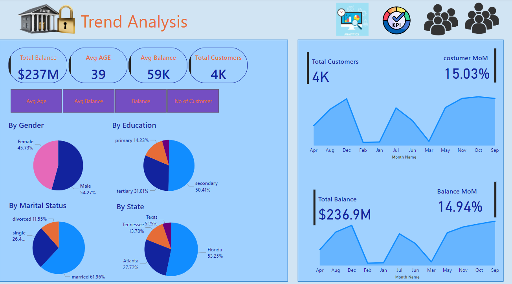

# Bank Data Analysis in Power BI

This project is a comprehensive analysis of bank customer data, created using Power BI to explore customer demographics, loan default statistics, trend analysis, and account balance insights. The goal of this project is to provide a clear visual representation of key metrics and trends to support data-driven decisions in banking.

## Table of Contents
1. [Project Overview](#project-overview)
2. [Data Sources and Preparation](#data-sources-and-preparation)
3. [Dashboard Screenshots](#dashboard-screenshots)
   - [Customer Analysis I](#customer-analysis-i)
   - [Customer Analysis II](#customer-analysis-ii)
   - [Trend Analysis](#trend-analysis)
   - [Bank Balance Dashboard](#bank-balance-dashboard)
4. [DAX Calculations](#dax-calculations)
5. [Insights and Key Findings](#insights-and-key-findings)
6. [How to Use](#how-to-use)
7. [Contact](#contact)

---

## Project Overview
This Power BI project provides an in-depth look at various aspects of bank data, focusing on customer demographics, financial trends, loan performance, and account balance distribution. The interactive dashboards offer insights that can help bank management understand customer behavior, segment customers based on various demographics, and monitor account performance over time.

## Data Sources and Preparation
- **Bank Data**: Contains transaction and demographic information.
- **Date Table**: Provides continuous date values for time-based analysis.
- **Selection Table**: Allows for custom filtering based on quarters, states, and other demographics.
- **Dim Table**: Additional dimension table for enhanced filtering and categorization.

## Dashboard Screenshots

### Customer Analysis I

This dashboard provides a breakdown of customers by:
- **Gender**: Distribution of male and female customers, with total loan balance for each gender.
- **Marital Status**: Insights into the marital status of customers, including loan default rates across different groups.
- **Job Type**: Analysis of customer job classifications, showing total balances for each type.
- **Loan Default**: Comparison of loan default rates across demographics, allowing bank analysts to identify segments with higher risks.

### Customer Analysis II

This dashboard explores customer data based on:
- **Age Distribution**: Histogram showing the distribution of customers by age group.
- **Geographical Insights**: Financial metrics by location, including total balance, average balance, and average customer age for states like Florida, Atlanta, Tennessee, and Texas.
- **Demographic Filters**: Interactive filters by education, gender, job classification, marital status, and state to drill down into specific customer segments.

### Trend Analysis

This dashboard presents a high-level view of key trends, including:
- **Overall Metrics**: Displays total balance, average age, average balance, and total customer count.
- **Monthly Trends**: Line charts for month-over-month (MoM) changes in total customers and balance, allowing for trend analysis over time.
- **Demographic Breakdown**: Pie charts showing demographic distributions by gender, education, marital status, and state, providing insights into the bank’s customer base composition.

### Bank Balance Dashboard

This dashboard focuses on account balance insights:
- **Total Balance**: Displays total balance across various segments.
- **Balance by Demographics**: Highlights total balances by renters, gender, and homeownership status, helping to identify high-value customer segments.
- **Visual Theme**: Uses an engaging and visually dynamic background to represent the banking theme, making the dashboard easy to interpret and visually appealing.

## DAX Calculations
Here are some of the DAX calculations used in this project:
- **Quarterly Sales Calculation**:
  ```DAX
  Quarterly Sales = CALCULATE(SUM('Bank Data'[Sales]), 'Date Table'[Quarter] = SELECTEDVALUE('Selection Table'[Quarter]))
  ```
- **Month-over-Month (MoM) Change**:
  ```DAX
  MoM Change = (SUM('Bank Data'[Balance]) - CALCULATE(SUM('Bank Data'[Balance]), DATEADD('Date Table'[Date], -1, MONTH))) / CALCULATE(SUM('Bank Data'[Balance]), DATEADD('Date Table'[Date], -1, MONTH))
  ```
- **Loan Default Rate**:
  ```DAX
  Loan Default Rate = DIVIDE(CALCULATE(COUNT('Bank Data'[Loan Status]), 'Bank Data'[Loan Status] = "Default"), COUNT('Bank Data'[Loan Status]), 0)
  ```

## Insights and Key Findings
- **Demographic Insights**: Majority of customers are married and employed in white-collar jobs, with a significant portion located in Florida.
- **Loan Default Patterns**: Higher default rates were observed among certain demographics, such as single and blue-collar workers.
- **Balance Trends**: Monthly analysis reveals a steady growth in customer base and total balance, with notable increases during specific months.

## How to Use
- **Clone or Download the Repository**: Download the `.pbix` file and open it in Power BI Desktop.
- **Interactive Filtering**: Use the interactive filters on each dashboard to explore different customer segments and financial insights.
- **Explore DAX Calculations**: Review the DAX calculations embedded in the report to understand how key metrics were calculated.

## Contact
If you have any questions about this project, feel free to reach out!


